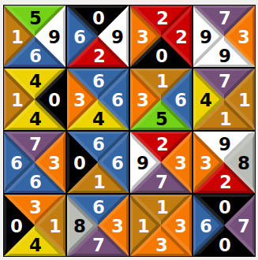
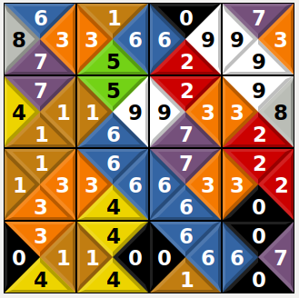
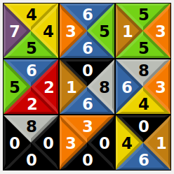

CMKV - Tetravex
=================

<p float="left">
  
   
</p>

This repository contains a Tetravex using the Metropolis-Hasting with recuit algorithm.

The proposed solution use recuit with multi-threading with as many thread as possible using diverse parameters.

---

## Usage

```bash
make main
./aout in.txt [out.txt]
```

The **second** charactere of the name of the file 'in.txt' is the size of the grid of Tetravex. The size goes from 3 to 6 (included).

The in.txt and out.txt have on each line the value of the cell in the following order:
NORTH - WEST - EAST - SOUTH

As an example, the following grid :
<p float="left">
  
</p>
corresponds to the file : s3-board.txt 

```bash
4745
6356
5135
6522
0186
8634
8000
3300
0416
```

---

## Testing ()

Testing includes both functionnal tests and unit tests (using Criterion)

```bash
make check
```

---

## Benchmark ()

Benchmarks are computed on 10 files for each possible size of Tetravex.

```bash
make bench
```

```bash
./bench
Running ./bench
Run on (12 X 2208.01 MHz CPU s)
CPU Caches:
  L1 Data 32 KiB (x6)
  L1 Instruction 32 KiB (x6)
  L2 Unified 256 KiB (x6)
  L3 Unified 9216 KiB (x1)
Load Average: 350.37, 245.65, 99.42
-------------------------------------------------------------------------
Benchmark               Time             CPU   Iterations UserCounters...
-------------------------------------------------------------------------
BM_Tetravex_s2      0.020 s         0.005 s           127 items_per_second=1.85682k/s
BM_Tetravex_s3      0.044 s         0.009 s            74 items_per_second=1.20834k/s
BM_Tetravex_s4      0.106 s         0.007 s           101 items_per_second=1.51342k/s
BM_Tetravex_s5      0.279 s         0.009 s            10 items_per_second=950.73/s
BM_Tetravex_s6       2.77 s         0.022 s            10 items_per_second=507.76/s
```


